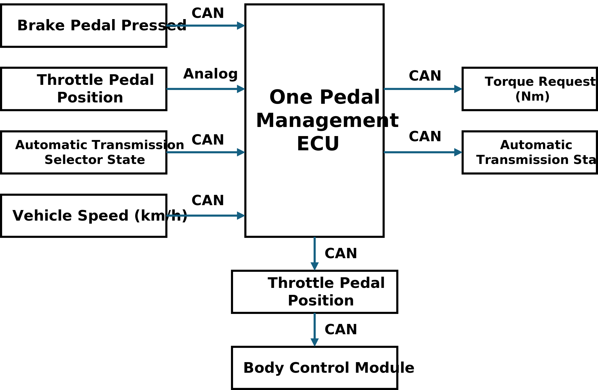

# Item definition & HARA for One Pedal Control

## Item definition

### Purpose of this document

The purpose of this document is to be the input for the “Hazard Analysis and Risk Assessment” (HARA) needed to comply with the ISO26262 standard. To ensure safety, all activities of the safety life cycle must be planned to avoid systematic failures.

This document describes the assumption on the `one pedal acceleration/braking system` item you should develop.

An additional purpose of this document is to define and describe the item, its functionality, dependencies on, and interaction with, the driver, the environmental conditions, external measure, the boundary of the item and interfaces to other items as well as assumptions concerning other elements at the vehicle level. This document will handle the requirements and recommendations for establishing the definition of the item, including its functionality, interfaces, environmental conditions, legal requirements, and known hazards.

### Purpose of the item

- To allow the driver to set the torque (positive acceleration, negative braking) applied on the driving wheels of a car. This system enables the driver to use only the throttle pedal for both the functions of accelerating or braking (up to a certain level) the vehicle. This system only allows use of the regenerative braking function of an electric/hybrid vehicle.

- As an assumption, the braking pedal is still inside the car, it acts directly on the hydraulic braking system, and its circuitry is independent of interferences from the “one” throttle/braking pedal. The information on whether the brake pedal is pressed is available for the considered item.

### Functional behavior

The automatic transmission selector is implemented as a by-wire (hence, no mechanical links between the transmission and the selector are present) and features, in the order, these positions: P (park), R (reverse), N (neutral), D (drive), and B (braking/one pedal). The driver can move the transmission selector at any moment, so the actually selected mode is shown on the dashboard screen. The item switches to the position chosen by the driver as soon as all related safety conditions are met.

The system can adopt two different behaviors, one when the automatic transmission selector (an independent system) is in the D position and the other in the B.

In particular:

- In D position mode, it reads the position of the throttle pedal and requires a traction torque proportional to the pedal position, as traditional in the automotive market. When the pedal is completely released, no torque is required meaning that the vehicle has its own braking force due to interaction with the air or the terrain, the internal combustion engine, or just the transmission power consumption due to internal frictions in the case of an electric vehicle. In this mode, to increase the braking torque, it is necessary to press the brake pedal and stop the vehicle completely. When the brake pedal is released in cars equipped with automatic transmissions, the vehicle starts to move slowly.

- In B (brake) position mode, the throttle pedal travel is divided into two regions:

  - regenerative braking, from the complete release up to a certain point (for example, 1/3 of the travel angle) that we can call the *neutral point*. The readout from the pedal inside this region is interpreted as a request for a braking torque, maximum when the pedal is completely released, then proportionally decreased upon the *neutral point*. When the pedal is released, the vehicle brakes up to completely stop its motion. From then on, the car remains stopped automatically regardless of the street slope. To make the vehicle moving, it is necessary to press the throttle pedal up to the acceleration region, described in the following, or to press the brake pedal and then release it.

  - Acceleration, from the neutral point up to the end of the travel (acceleration region), where the position is interpreted as a request of a traction torque proportional to the pedal position.

The behavior can be described mathematically as follows:

$$
τ_r=-max(τ_a)⋅(1-3p)~~~~~when~~0\lt p\le\frac{1}{3} (braking~region).
$$

$$
τ_r=max(τ_a)⋅\frac{3}{2}⋅ (p-\frac{1}{3})~~~~~when~~\frac{1}{3}\lt p\le 1 (acceleration~region)
$$

where:

1. $τ_r$ is the requested torque.
2. $p$ is the pedal position expressed in normalized [0,1] range.
3. $max(τ_a)$ is the maximum acceleration torque in the forward direction.

The requested torque is positive to indicate a forward acceleration action or negative to indicate a braking (or backward) acceleration action (from here, the – sign in the equation 1).

Of course, it is still possible to use the braking pedal in case of emergencies or to increase the braking torque thanks to the hydraulic brakes.

| Function                            | Operating elements                                           |
| ----------------------------------- | ------------------------------------------------------------ |
| Determine torque request            | Throttle pedal                                               |
| Select transmission mode (behavior) | Automatic transmission selector                              |
| Brake pedal pressed                 | Data from the CAN bus regarding the status of the braking pedal |
| Driver notifications                | Tell the driver the selected mode on the dashboard (between P, R, N, D, and B) and eventual faults. This is usually the one chosen by the by-wire selector |

### Functional block diagram

### Boundaries of the system responsibility and interfaces

- The system is in charge of providing the torque request (positive or negative) to the electric motor (EM) electronic control unit (ECU).
- It provides this request through the vehicular Controller Area Network (CAN).
- It has to compute this torque request based on the gear selector position (negative torque only for the B position). 
- Moreover, it has to check the vehicle speed to determine the torque effects, in particular preventing that, during the regenerative breaking, the negative torque request causes the vehicle to move in the reverse direction.
- Another responsibility is to keep the vehicle stopped until the throttle pedal reaches the acceleration position and to monitor when the braking pedal is pressed to make the car slowly move when it is released.
- In the reverse gear, the car acts like a standard automatic transmission car, so the vehicle only stops when the braking pedal is pressed and starts to slowly move backward when it is released.
- Moreover, the transition between the position N and R or D/B is accepted only when the speed of the vehicle is lower than 5 km/h (in the same motion direction) AND the brake pedal is pressed, with the only exception on the selection of the N (neutral), which can be accepted at any time and causes the vehicle to move freewheel. The transition between R and P can be accepted only with the car almost still, and the braking pedal pressed.

## Hazard Analysis and Risk Assessment 

### Definition of possible functional failures

| **Failure ** | **Description**                                 |
| ------------ | ----------------------------------------------- |
| F1           | Torque request too much                         |
| F2           | Torque request too low                          |
| F3           | ECU processing gets too  much pedal down angle  |
| F4           | ECU processing gets too small  pedal down angle |
| F5           | Failed to check vehicle  speed                  |

### Analyzes of Hazardous Situations 

| H1   | Unintended vehicle acceleration                   |
| ---- | ------------------------------------------------- |
| H2   | Unintended vehicle deacceleration                 |
| H3   | Insufficient vehicle acceleration                 |
| H4   | Insufficient vehicle deacceleration               |
| H5   | Unintended vehicle motion in  incorrect direction |

**H1**

- This hazard causes losing control of the vehicle, may bring about colliding with passersby, other vehicles or obstacles, or running off the road.

**H2**

- This hazard could result in a rear-end collision

  **Exceptions and Boundary Conditions to H2:**

  - Unexpected deacceleration caused by mechanical systems are not considered.

**H3**

- This hazard may affect the normal operation of the vehicle, possibly resulting in rear-end collisions or the inability to avoid unexpected obstacles in a timely manner.

  **Exceptions and boundary conditions for H3:** 

  - This problem is to be seen as a risk when there is a high demand for acceleration, such as when overtaking a vehicle or entering a freeway 

  -  At low speeds or during smooth driving, the effect of the problem is less severe.

**H4**

- This hazard may result in the driver not being able to decelerate in a non-emergency situation, thus increasing the risk of a collision.

  **Exceptions and boundary conditions for H4**: 

  - In emergency circumstances, drivers should use the brake pedal for mechanical breaking, drivers accustomed to using one brake may lose braking time in this situation

**H5**

- This hazard may occur due to no declaration that the gearbox is only allowed to move in one direction, causing the driver to be unable to control the vehicle effectively and increasing the risk of collision with other vehicles, pedestrians or obstacles.

### Analysis of situations

#### Driving scenarios

##### Description of the possible **driving situations**

- DS1: Freeway
- DS2: Crowded Road
- DS3: Slippery road

##### Definition of the **vehicle status**

- VS1: High speed 
- VS2: Low speed 
- VS3: Reversing
- VS4: Stopped

##### Considerations

| **Operational  Situations** | **Driving  situation** | **Vehicle  status** |
| --------------------------- | ---------------------- | ------------------- |
| OS1                         | Freeway                | High speed          |
| OS2                         | Freeway                | Low speed           |
| ~~OS3~~                     | ~~Freeway~~            | ~~Reversing~~       |
| ~~OS4~~                     | ~~Freeway~~            | ~~Stopped~~         |
| ~~OS5~~                     | ~~Crowded Road~~       | ~~High speed~~      |
| OS6                         | Crowded Road           | Low speed           |
| OS7                         | Crowded Road           | Reversing           |
| OS8                         | Crowded Road           | Stopped             |
| OS9                         | Slippery road          | High speed          |
| OS10                        | Slippery road          | Low speed           |
| OS11                        | Slippery road          | Reversing           |
| OS12                        | Slippery road          | Stopped             |

### Analysis

|             |                   |               |                   |               |                  |                   |                   |                   |                      |                   |          |
| ----------- | ----------------- | ------------- | ----------------- | ------------- | ---------------- | ----------------- | ----------------- | ----------------- | -------------------- | ----------------- | -------- |
| **Hazards** | OS1               | OS2           | OS6               | OS7           | OS8              | OS9               | OS10              | OS11              | OS12                 | **Top OS**        | **ASIL** |
| H1          | S:3  E:1  C:2     | S:3  E:1  C:2 | **S:3  E:3  C:3** | S:2  E:2  C:2 | S:2  E:2  C:2    | S:3  E:1  C:2     | S:3    E:2    C:2 | S:2    E:2    C:2 | S:2    E:2    C:2    | S:3    E:3    C:3 | **C**    |
| H2          | S:2  E:3  C:2     | S:2  E:2  C:2 | S:2  E:3  C:1     | S:1  E:3  C:1 | ~~S:   E:   C:~~ | **S:3  E:1  C:3** | S:2    E:2    C:2 | S:1    E:2    C:2 | ~~S:     E:     C:~~ | S:3  E:1 C:3      | **A**    |
| H3          | **S:3  E:2  C:2** | S:2  E:1  C:2 | S:2  E:3  C:1     | S:1  E:2  C:1 | S:1  E:2  C:1    | S:2  E:1  C:2     | S:1    E:2    C:1 | S:1    E:2    C:1 | S:1    E:1    C:2    | S:3    E:2    C:2 | **A**    |
| H4          | S:3  E:2  C:2     | S:3  E:2  C:2 | **S:3  E:3  C:1** | S:2  E:3  C:1 | S:1  E:2  C:1    | S:3  E:2  C:2     | S:2    E:3    C:2 | S:1    E:2    C:1 | ~~S:     E:     C:~~ | S:3    E:3    C:1 | **A**    |
| H5          | S:3  E:2  C:3     | S:3  E:1  C:3 | **S:2  E:3  C:3** | S:2  E:2  C:3 | S:2  E:3  C:3    | S:3  E:1  C:3     | S:3    E:2    C:3 | S:2    E:2    C:3 | S:3    E:2    C:3    | S:2    E:3    C:3 | **B**    |

------

[[1\]](#_ftnref1) Remember that the ASILs are assigned to the Safety Goals and not to failures. 

These ASILs are reported in the table just for the reader convenience.

### Operational Situations – Comment of entries

Analyze in this way two other scenario/failure associations at your choice.

| H1/S6 *Effect* | *Sudden acceleration of vehicles  on congested roads* *in crowded environments* |       |
| ------------------ | ------------------------------------------------------------ | ----- |
| *Statement  S*     | *A* *collision with a vehicle or  pedestrian ahead.*         | *S:3* |
| *Statement  E*     | *Almost  every day (like in the city road).*                 | *E:3* |
| *Statement  C*     | *Insufficient distance to  pedestrians in front of vehicle, difficult for driver to react* | *C:3* |

| H3/S6 *Effect* | *Sudden change of direction of  motion of a vehicle in a crowded environment* |       |
| ------------------ | ------------------------------------------------------------ | ----- |
| *Statement  S*     | *A* *collision with a vehicle or pedestrian ahead* *or* *hit by  the tail**.* | *S:2* |
| *Statement  E*     | *Almost  every day (like in the city road).*                 | *E:3* |
| *Statement  C*     | *Change of direction makes it  difficult for the driver to react to how to solve the problem* | *C:3* |

### Safety goals

| SG1  | Prevent unintended acceleration                              |
| ---- | ------------------------------------------------------------ |
| SG2  | Prevent unintended deceleration                              |
| SG3  | Prevent insufficient acceleration                            |
| SG4  | Prevent insufficient deceleration                            |
| SG5  | Prevent unintended vehicle motion  in incorrect direction    |
| SG6  | Warn  the driver in any case of malfunctions and the item shall enter the safe  state |

### Results

| **Failure/**  **Malfunction/**  **Hazardous  situation** | **Safety  goal**                                             | ASIL | **Safe  state**                                              | **FTTI** |
| -------------------------------------------------------- | ------------------------------------------------------------ | ---- | ------------------------------------------------------------ | -------- |
| F1 Torque request too much                          | SG1 Prevent unintended acceleration                     | C    | Impose  torque request = 0. Warning the driver of failure  via sound and screen | 100ms    |
| F1 Torque request too much                          | SG2 Prevent unintended deceleration                     | A    | Impose  torque request = 0. Warning the driver of failure  via sound and screen | 500ms    |
| F1 Torque request too much                          | SG5 Prevent unintended vehicle motion in incorrect  direction | B    | Impose  torque request = 0. Warning the driver of failure  via sound and screen | 200ms    |
| F2 Torque request too low                           | SG3 Prevent insufficient acceleration                   | A    | Warning  the driver of failure via sound and screen          | 500ms    |
| F2 Torque request too low                           | SG4 Prevent insufficient deceleration                   | A    | Warning  the driver of failure via sound and screen          | 500ms    |
| F3 ECU processing gets too much pedal down angle    | SG1 Prevent unintended acceleration                     | C    | Impose  torque request = 0. warning the driver of failure    | 100ms    |
| F4 ECU processing gets too small pedal down angle   | SG3 Prevent insufficient acceleration                   | A    | Warning  the driver of failure via sound and screen.         | 500ms    |
| F5 Failed to check vehicle speed                    | SG5 Prevent unintended vehicle motion in incorrect  direction | B    | Limiting  the power output of the car and warning the driver of failure. | 200ms    |