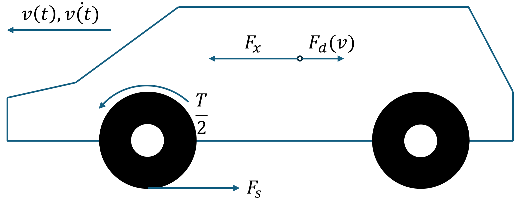
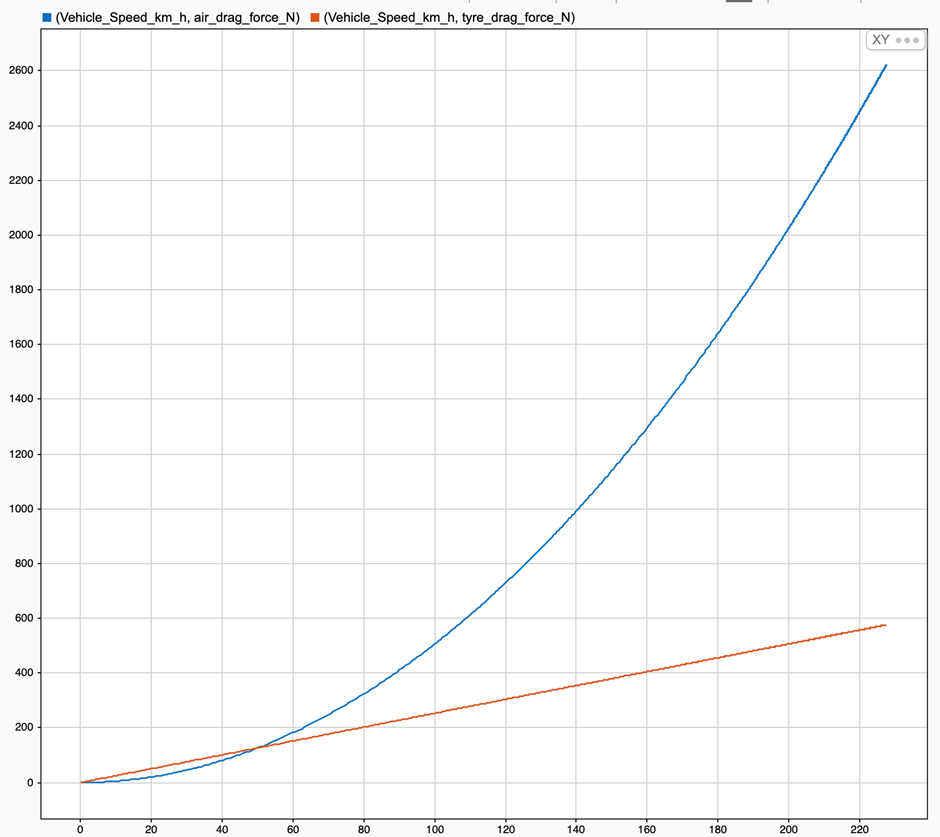
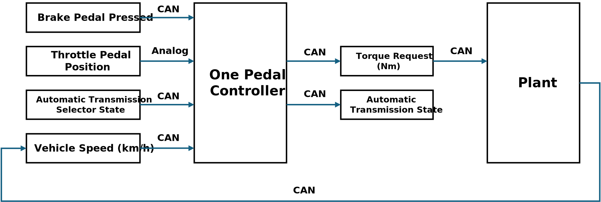
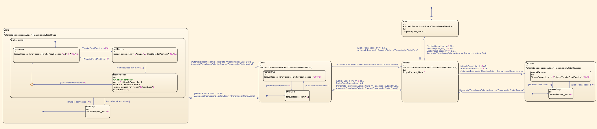

# Controller Description

## Equations of the plant

The plant considered in this model is the so-called ***Vehicle Longitudinal Dynamics***.

Considering:

- $\dot{v}(t)$ the vehicle acceleration, expressed in $[m/s^2]$
- $v(t)$ the vehicle longitudinal speed, expressed in $[m/s]$
- $m$ the vehicle mass, expressed in $[kg]$
- $F_x(t)$ the longitudinal force applied to the vehicle center of gravity, expressed in $[N]$
- $F_s(t)$ the longitudinal force applied to the wheel on the terrain, expressed in $[N]$
- $F_d(v)$ the longitudinal force applied to the vehicle center of gravity due to the frictions with air and terrain, expressed in $[N]$
- $I$ the moment of inertia of each one of the wheels, expressed in $[kg\cdot m^2]$
- $r$ the radius of the wheel, expressed in $[m]$
- $\omega(t)$is the angular speed of the wheel, expressed in $[rad/s]$
- $\omega_e(t)$ is the angular speed of the engine/electrical motor, expressed in $[rad/s]$
- $ \omega_{eRPM}(t)=\omega_e(t) \cdot 60/ 2\pi $ is the angular speed of the engine/ electrical motor, expressed in $[revolution\;per\;min]$
- $\dot{\omega}(t)$ is the angular acceleration of the wheel, expressed in $[rad/s^2]$
- $S$ is the frontal surface of the car, expressed in $[m^2]$
- $C_x = 0.3$ is the automobile drag coefficient
- $\rho$ is the average density of air at sea level in standard conditions $1.25kg/m^3$ 
- $i_g$ is the gearbox reduction ratio
- $i_f$ is the final drive reduction ratio
- $i_t=i_f\cdot i_g$ is the total power train reduction ratio.

An extremely simplified model can be obtained as follow:
$$
\begin{align\\*}
\dot{v}(t) = \frac{F_x(t) - F_d(v)}{m}\tag{1}
\end{align\\*}
$$

$$
\begin{equation} \dot{v}(t) = \frac{F_x(t) - F_d(v)}{m}\tag{1} \end{equation}
$$

where $\dot{v}(t)$ is the vehicle acceleration, $m$ is its mass,  $F_x(t)$ is the longitudinal force applied to its center of gravity by the effects of the torque applied on the wheels, and $F_d(v)$ is the sum of the friction forces on the vehicle due to wheel-terrain and vehicle-air interactions.

Considering that the torque is equally split between the two wheels (valid only on straight tracks)

$$
\begin{equation}T(t)-2F_s(t)\cdot r = 2I\cdot \dot{\omega}(t)\tag{2} \end{equation}
$$

the absence of slipping:

$$
\begin{cases} 2r\cdot2F_s(t)= F_x(t)\\ v(t)=2\pi r \cdot \omega(t) \end{cases}
$$

and considering the moment of inertia of the wheels $I=0$, we can define the following equation, given that 

$$
T(t) = 2r\cdot F_s(t)
$$

The drag force that limits the maximum speed of the vehicle is equal to:

$$
\begin{equation} F_d\ (v(t))=X_{air}\cdot(v(t))^2+X_{tyres}\cdot v(t)\tag{3}\end{equation}
$$

where

$$
\begin{equation}X_{air}=\frac{1}{2}\cdot S\rho\cdot c_x\tag{4}\end{equation}
$$

and, as usually modeled:

$$
\begin{equation} X_{tyres}\ |_(X_{tyres}\ (50\ km/h)=X_{air}\ (50\ km/h)\ )\rightarrow\ X_{tyres}=(X_{air}\cdot50)/3.6\tag{5}\end{equation}
$$

By substituting the (2) equation in (1), and by integrating both sides, we obtain:

$$
\begin{equation} v(t)=
\frac{1}{m} ∫_0^t F_x (t)-F_d (v(t)) dt=
\frac{1}{m} ∫_0^t 2⋅F_s (t)- F_d (v(t))dt=
\frac{1}{m} ∫_0^t  \frac{T(t)}{r}- F_d (v(t))dt\tag{6}\end{equation}
$$

and, by substituting (3) in (6):

$$
\begin{equation} v(t)=\frac{1}{m} ∫_0^t \frac{T(t)}{r}-  X_{air}⋅(v(t))^2-X_{tyres}⋅v(t) dt     \tag{7}\end{equation}
$$

Remember that the integrator block of Simulink requires an initial condition corresponding to the vehicle's longitudinal speed at the beginning of the simulation, $v(0)$ . A possible configuration of the integration block is shown in Figure 2.

During the model development, put all the needed gain to obtain as an output of the physical model a speed expressed in km/h.

To simulate the slope $\theta$ of the terrain, it is possible to add the gravity force $F_g(\theta)$ as follows:

$$
\begin{equation} v(t)=\frac{1}{m} ∫_0^t\frac{T(t)}{r}-  X_{air}⋅(v(t))^2-X_{tyres}⋅|v(t)|dt+mgsin⁡(θ)     \tag{8}\end{equation}
$$

With $g = 9.81$ the gravity acceleration on Earth.

Reasonable values for an electric compact car can be:

- $m=1600 kg$
- $r=0.3 m$
- The torque $T$ (at the wheel) can vary in the range $[-60;960]$  Nm
- $S=3.5 m^2$
- $c_x=0.3$

> Figure 1 Graph showing drag forces of tires (in orange) and air (in blue) at various speeds. It is possible to observe that, as imposed in equation (5), $X_{tyres}=X_{air}$ at $50 km/h$. Below this speed, the tire drag is dominant, after that, the air drag is dominant. Moreover, it is possible to see the top speed of the car (around 230 km/h) when $F_x= \frac{T}{r}=X_{tyre}+X_{air}$ with $F_x=3200N$

With those values, the top speed on level ground reachable by the car is about 230 km/h, where the drag forces equal the traction force (3200 N).Considering the reverse direction, the maximum speed reachable with a limitation of -60 Nm is about 45 km/h.

> [1] Usually, the first gear of a car has a transmission ratio about $i_g=3$ , hence the engine makes 3 complete rotations very single rotation of the pinion gear of the differential. In the differential (final drive), the pinion gear makes about $i_f=4$ revolutions for every revolution of the axle shafts. From here, the typical ratio of $i_t=12$ between the torque at the wheel and the torque at the engine/electrical motor.

## External interfaces of the plant

| **Name**                            | **Direction**                             | **Type**            |
| ----------------------------------- | ----------------------------------------- | ------------------- |
| **Requested_Torque_Nm**             | Input                                     | CAN                 |
| **Vehicle_Speed_km_h**              | Output                                    | CAN                 |
| **Automatic_Transmission_Selector** | Input (from the driver to the controller) | CAN {P, R, N, D, P} |
| **Selected  mode/errors**           | Output (to the driver)                    | CAN                 |

 

## Controller SW Unit specifications

### Description of the whole system

*Draw the I/O block diagram of the plant and the controller, showing how they interact.*

### Interfaces

| **Name**                           | **Unit** | **Type$^2$** | **Data Type$^3$** | **Dimension** | **Min**  | **Max** |
| ---------------------------------- | -------- | ------------ | ----------------- | ------------- | -------- | ------- |
| BrakePedalPressed                  | N/A      | input        | boolean           | 1*1           | 0(false) | 1(true) |
| ThrottlePedalPosition              | N/A      | input        | single            | 1*1           | 0        | 1       |
| AutomaticTrasmission SelectorState | N/A      | input        | TrasmissionState  | 1*1           | N/A      | N/A     |
| VehicleSpeed_km_h                  | km/h     | input        | single            | 1*1           | -45      | 230     |
| AutomaticTransmission  State       | N/A      | output       | TrasmissionState  | 1*1           | N/A      | N/A     |
| TorqueRequest_Nm                   | Nm       | output       | single            | 1*1           | -40      | 80      |
| sumError                           | N/A      | local        | single            | 1*1           | -inf     | inf     |
| error                              | N/A      | local        | single            | 1*1           | -inf     | inf     |

[2] Input, Output, Local, Global, Volatile

[3]Struct, Double, Integer, Enum, Boolean, etc…

*Draw the Finite State Machine (FSM) representing the controller logic*

------

*Comment on the design choices of the FSM, which are not trivial to be understood just by analyzing the controller logic.*

| **State name** | **Description in natural language**                          |
| -------------- | ------------------------------------------------------------ |
| *Park*         | **When in the state of** **“*****Park\***”**, the torque request is 0,  AutomaticTransmissionState set to Park.     **When BrakePedalPressed is  True AND AutomaticTrasmissionSelectorState** **is not** **“\*Park\*****”**,  the state transforms to Neutral*.* |
| *Neutral*      | **When in the state of** **“\*Neutral\*”**, the torque request is 0,  AutomaticTransmissionState set to Neutral.     **When BrakePedalPressed is True AND AutomaticTrasmissionSelectorState** **is** **“Reverse****” AND** **vehicle speed less than 5km/h**, the state transforms to *Reverse*.     **When BrakePedalPressed is True AND AutomaticTrasmissionSelectorState** **is** **“Drive “or “Brake” AND** **vehicle speed over than -5km/h**, the state transforms to *Drive*. |
| *Reverse*      | **When in the  state of** **“\*Reverse\*”**,  AutomaticTransmissionState set to *Reverse*.     **When BrakePedalPressed is True**, get into substate *reverseStop*, cutting off control of the motor from the throttle pedal -- set TorqueRequest_Nm  = 0.  **When BrakePedalPressed is** **False**, get into substate *normalReverse*, set TorqueRequest_Nm  =  -40* ThrottlePedalPosition, at this time, the vehicle speed will gradually  backward     **When AutomaticTrasmissionSelectorState** **is** **not** **“Reverse”**, the state  transforms to *Neutral*. |
| *Drive*        | **When in the  state of** **“\*Drive\*”**,  AutomaticTransmissionState set to *Drive*.     **When BrakePedalPressed is True**, get into substate *driveStop*, cutting off control of the  motor from the throttle pedal -- set TorqueRequest_Nm = 0.  **When BrakePedalPressed is** **False**, get into substate *normalDrive*, set TorqueRequest_Nm  =  80* ThrottlePedalPosition. At this time, the vehicle will gradually speed up  with pedal position.     **When AutomaticTrasmissionSelectorState** **is** **“Neutral”**, the state transforms to *Neutral*. |
| *Brake*        | **When in the  state of** **“\*Brake\*”**,  AutomaticTransmissionState set to *Brake*.     **When BrakePedalPressed is True**, get into substate *BrakeStop*,  cutting off control of the motor from the throttle pedal - set TorqueRequest_Nm  = 0.     **When BrakePedalPressed is** **False**, get into substate *normalBrake*.    ·       **When ThrottlePedalPosition**≤*1/3**, will get  into substate *barkDecele*, the controller requires negative torque according to pedal position set TorqueRequest_Nm  = 240*(ThrottlePedalPosition-1/3).   ·       **When ThrottlePedalPosition>1/3,** will get into  substate *brakeAccle*, the controller requests the corresponding torque  in the interval 1/3 to 1 set TorqueRequest_Nm = 120*(ThrottlePedalPosition-1/3).  ·       **When VehicleSpeed_km_h****≤** **0.2 AND in \*brakeAccle\* sub****state**, will get into substate *brak0Velocity,* the controller will output  negative torque according to the current speed to make the vehicle stop when  the speed is equal to zero.     **When AutomaticTrasmissionSelectorState** **is** **“Neutral” or “Drive”**, the state transforms to *Drive*. |

